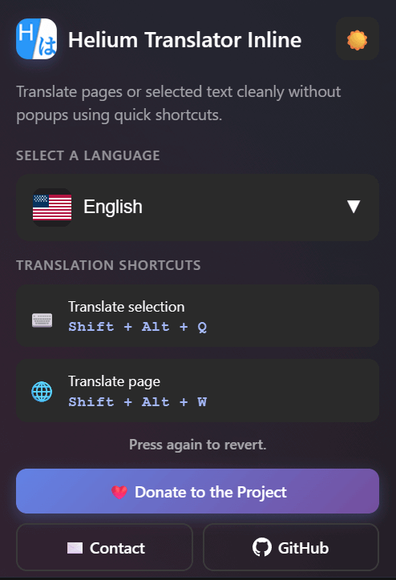

# Helium Translator Inline

The project started when moving from Microsoft Edge to Helium Browser revealed the lack of a translation flow comparable to Edge’s native feature, so the extension was built to fill that gap—and it works seamlessly in any Chromium browser, including Chrome and Edge. Fast shortcuts keep the workflow fluid while the interface stays clean.

- Helium Browser and most other Chromium-based browsers
- [Google Chrome](https://chromewebstore.google.com/detail/helium-translator-inline/odibgflepadohfmpcemnjbhkionjkapk) 3+ 
- [Microsoft Edge](https://microsoftedge.microsoft.com/addons/detail/nbnmfihmepgnmpfaohjmdljphdkkmhoh) 1+ 
- [Opera] soon...



<p align="center">
  Made by <a href="https://github.com/wesleymartinsdv">Wesley Martins</a>
</p>


## Features

- Inline translation for full pages and highlighted passages
- Keyboard shortcuts: `Shift + Alt + Q` (selection) and `Shift + Alt + W` (page)
- Minimal popup with light and dark themes
- Favorite languages, quick search, and complete UI localization
- Store metadata localized via `_locales/<lang>/messages.json`

## Disclaimer

This extension uses the Google Translate service to provide translations but is not affiliated with, endorsed, or sponsored by Google. All copyrights and trademarks belong to their respective owners.

## Known Limitations

- Due to browser security restrictions, this extension cannot run on internal pages (e.g., `chrome://`, `edge://`) or on the Chrome Web Store / Edge Add-ons website itself.
- Translation relies on an external service and requires an active internet connection.

### Manual installation (development build)

1. Clone this repository or download the latest release ZIP.
2. Open `chrome://extensions` (or `edge://extensions`) and enable **Developer mode**.
3. Click **Load unpacked** and choose the project root (`heliumExtension`).
4. Use the refresh icon whenever you change local files.

## Development

- Popup assets live in `ui/` and shared styles in `css/`.
- `src/background.js` manages keyboard shortcuts; `src/content.js` applies inline translations.
- UI strings are defined in `ui/i18n.js`; store messages mirror them under `_locales/`.
- Preferences persist via `chrome.storage.sync` and are restored on load.
- Use the service worker inspector in `chrome://extensions` to review logs.

## Repository Structure

```text
manifest.json
src/
ui/
css/
icons/
_locales/
docs/
```

## Privacy and Support

- Privacy policy: `docs/PrivacyPolicy.md`
- Contact: `wesleydeveloper@icloud.com`
- GitHub: <https://github.com/wesleymartinsDV/helium-translator-inline>

## License

Feel free to contribute! Keep in mind that the license I chose
is [GPL v3](https://github.com/wesleymartinsDV/helium-translator-inline/blob/main/LICENSE)